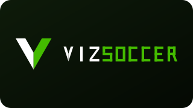

# VizSoccer



Biblioteca de tecnificación de fútbol: 52 ejercicios (26 individuales y 26 por parejas, incluidos 12 avanzados, 6 de ellos de finalización).

## Contenido

- `index.html`: catálogo visual animado con filtros.
- `planes.html`: planes filtrables de 3 días por semana.
- `ejercicios.json` y `ejercicios.csv`: base de datos de ejercicios.
- `planes_entrenamiento.json`, `planes_entrenamiento.csv` y `PLANES.md`: base de datos de planes.
- `brand/`: logotipo de la marca (`logo.svg`, `logo-mark.svg`, `logo-wordmark.svg`).
- `svg/`: un diagrama vectorial editable por ejercicio.
- `gif/`: una demostración animada por ejercicio (fuente original).
- `webp/`: las mismas demostraciones en WebP animado (~70 % más ligeras; es lo que carga la web).

## Leyenda

- Línea blanca continua: desplazamiento o conducción.
- Línea amarilla discontinua: pase o recorrido del balón.
- Punto verde: inicio. Bandera: final.
- A/B: jugadores.

Los SVG son editables en navegadores, Inkscape, Illustrator, Figma y Canva. Cada ficha incluye objetivo, nivel, duración, material, instrucciones y secuencia animada.

## Planes disponibles

Se incluyen 6 planes de cuatro semanas: individual o por parejas y niveles iniciación, intermedio y avanzado. Todos se organizan en tres días por semana y cada sesión dura 60 minutos trabajando todas las áreas técnicas: 10 ejercicios de 5 minutos más calentamiento y vuelta a la calma.

## App instalable (PWA)

El sitio funciona como aplicación instalable en Android (y escritorio): incluye `manifest.webmanifest`, iconos adaptativos y un service worker (`sw.js`) que guarda en caché los ejercicios ya vistos para poder entrenar sin conexión. Durante el modo entrenamiento la pantalla se mantiene encendida, el cronómetro sigue la hora real aunque la app pase a segundo plano, al terminar cada bloque suena un aviso y vibra el móvil (con avance automático opcional al siguiente bloque), y el botón atrás cierra las fichas y el entrenamiento en lugar de salir de la app.

Además, todo se guarda en el dispositivo (`localStorage`): sesiones completadas por plan y día, ejercicios favoritos (con filtro ★ en el catálogo) y preferencias. Las fichas se pueden compartir con enlaces directos del tipo `index.html#IND-01`, hay modo oscuro automático según el sistema y un aviso cuando se navega sin conexión.

Para regenerar el logotipo y los iconos: `OUTPUT_DIR=. python3 scripts/logo.py` (requiere Pillow para los PNG). Para regenerar los WebP animados a partir de los GIF: `OUTPUT_DIR=. python3 scripts/build_webp.py`. Al publicar cambios, incrementa `VERSION` en `sw.js` para invalidar la caché.

## Marca

El logotipo es una **V de dos brazos** más el logotipo partido en dos colores: **VIZ en blanco y SOCCER en verde**. Es la misma construcción que usa VizPlay, así que las dos apps se leen como una familia: la geometría se calcula en `scripts/logo.py` (no se dibuja a mano) para que la V del icono, la del logotipo y las letras tengan siempre las mismas proporciones.

La paleta gira alrededor del verde de marca **`#44BB00`**:

| Papel | Oscuro | Claro |
| --- | --- | --- |
| Verde de marca (rellenos, bordes) | `#44BB00` | `#44BB00` |
| Verde de texto (`--primary-ink`) | `#63D916` | `#2F7D00` |
| Fondo | `#0A1409` | `#F1F7EA` |
| Superficie | `#121D10` | `#FFFFFF` |
| Texto | `#E9F3E3` | `#101D0B` |

El verde pleno no tiene contraste suficiente como texto sobre blanco, así que `--primary` se reserva para rellenos y bordes y `--primary-ink` para el texto. Los niveles usan una rampa que convive con el verde sin competir con él: lima (iniciación) → ámbar (intermedio) → coral (avanzado).

## Regenerar la colección

Requiere Node.js y Python con Pillow instalado.

```bash
OUTPUT_DIR=. node scripts/build_catalog.mjs
OUTPUT_DIR=. python3 scripts/build_gifs.py
OUTPUT_DIR=. python3 scripts/build_plans.py
```

Las animaciones usan una línea temporal específica para cada ejercicio. Los pases, controles, desmarques y tiros se sincronizan con la posición del balón.
